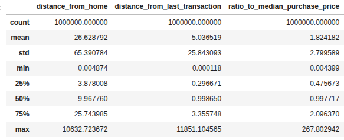
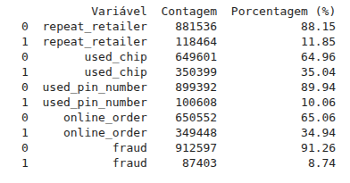
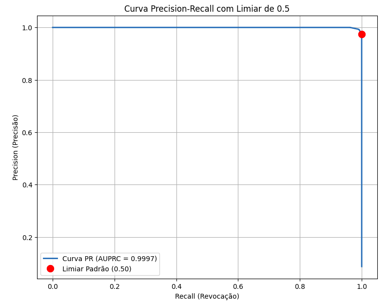

# Prova--Deteccao-de-Fraude

## **Modelo de Detecção de Fraude**

### **Entendimento do negócio**

O objetivo é projetar e avaliar um modelo de detecção de fraude em transações de cartão em tempo real, potencialmente integrável ao motor de decisão da Vom. A métrica que queremos otimizar é a recorrência,pois aprovar uma fraude é mais custoso que negar indevidamente uma transação legítima.

### **Entendimento dos dados**

Observando os percentuais das variáveis booleanas podemos ver que o conjunto é bastante desbalanceado,pois só 8.7% das transações são fraudulentas. Repeat\_retalier,used\_pin\_number também são bastante desbalanceadas.

 

As três variáveis numéricas tem alguns valores extremos. As médias são significativamente maiores que as medianas. Em distribuições simétricas, elas seriam próximas. Uma média muito maior indica que os valores mais altos (outliers) estão puxando a média para cima, caracterizando uma assimetria positiva (à direita).

### **Preparação dos dados**

Não existem dados ausentes e não é necessário fazer a normalização dos dados,pois vou usar modelos que não tem essa necessidade. 

Também não foram identificadas variáveis correlacionadas para serem removidas e não existem variáveis categóricas onde seria necessária a codificação

### **Modelagem**

Foram testados os modelos regressão log xgboost. Este tipo de regressão é um modelo simples e interpretável,recomendado para as fases iniciais de modelagem.O xgboost é um modelo em árvore com boost,mas é menos interpretável.

### **Avaliação**

 O modelo com regressão log obteve recorrência de 0.95 e o modelo Xgboost 0.99, então foi escolhido o Xgboost para colocar em produção por ter a maior recorrência.

Diminuir o limiar aumenta a sensibilidade do modelo. Isso aumenta a Recorrência (↓FN) e, geralmente, diminui a Precisão (↑FP). O ponto de desempenho se move para baixo e para a direita no gráfico PR. Aumentar o Limiar: aumenta a seletividade/rigor do modelo. Isso aumenta a Precisão (↓FP) e, geralmente, diminui a Recorrência (↑FN). O ponto de desempenho se move para cima e para a esquerda no gráfico PR. Aqui foi usado o limiar padrão de 0.5 pois ele já maximiza a recorrência.

 Faz sentido usar o modelo xgboost, embora seja menos explicável que a regressão log ele teve o melhor desempenho,que é o mais importante aqui.

### **Produção / Monitoramento** (plano)

Esta fase transforma o modelo treinado em um serviço acessível para previsões em tempo real:

* Modelo (Model): O modelo treinado e o código do servidor web (Docker Image) são registrados no SageMaker.  
* Configuração do Endpoint (Endpoint Configuration): Define-se a infraestrutura (tipo de instância de hospedagem, escalabilidade) e se anexa o monitoramento (Data Capture) para salvar os dados de entrada e saída.  
* Criação do Endpoint (Endpoint): O modelo é implantado, provisionando a infraestrutura e criando uma API HTTPS de baixa latência para receber requisições de previsão.

Após a implantação, o SageMaker Model Monitor garante a integridade e o desempenho contínuo do modelo:

* Captura de Dados: Os dados de entrada e saída (payloads) das invocações do Endpoint são salvos em um bucket S3.  
* Detecção de Drift: Os dados capturados são continuamente comparados a um baseline (os dados de treinamento) para identificar desvios na qualidade dos dados de entrada (Data Quality Drift) ou no desempenho do modelo (Model Quality Drift).  
* Alertas: Caso o desvio detectado ultrapasse os limites configurados, alertas são enviados via Amazon SNS (Simple Notification Service).

